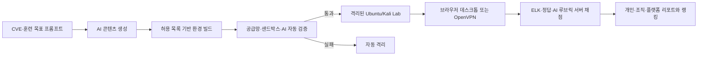

# ZeroTOP

**Zero-day Training Orchestration Platform**

AI가 최신 CVE와 훈련 목표를 바탕으로 강의 자료, 취약 환경, 공격·방어 시나리오와 문제를 생성하고, 격리된 실습 환경에서 자동 검증·채점·역량 분석까지 수행하는 실전형 사이버 레인지 플랫폼입니다.

이 저장소는 데모 화면만 제공하는 프로젝트가 아니라, 웹/API/AI/빌더/검증/채점/텔레메트리/가상화/VPN/관리 기능과 운영 인프라 코드를 함께 구성한 프로덕션 지향 코드베이스입니다.

## 구현 범위

- `Next.js 16 + React 19 + TypeScript` 웹: 설계·검증, 실습 워크스페이스, 리포트, 랭킹, 관리자 화면
- OIDC/Keycloak 인증과 개인·조직 가입: 한 사용자는 조직에 속하지 않거나 정확히 한 조직에만 소속
- 블루팀 Lab: Ubuntu 기반 분석 환경, 실행별 ELK 검색, 증거 선택, MITRE ATT&CK 매핑
- 레드팀 Lab: Kali/Ubuntu 환경, 단일 선택·복수 선택·주관식·MITRE ATT&CK 문제
- AI Lab Builder: NVD로 확인한 CVE 정보와 운영자 승인 component catalog를 기반으로 학습 본문, 공개 문제, 비공개 채점 계약, 텔레메트리, 선언형 이미지 빌드 명세 생성
- 환경 빌더: 허용 목록으로 제한한 명세를 rootless BuildKit 작업으로 빌드하고 이미지 digest와 provenance 기록
- 자동 검증: 서명, SBOM, 취약점 스캔, 기능·의도된 취약점 probe, 네트워크 격리, 블루팀 ELK 검색을 모두 통과해야 승인
- 실습 런타임: 실행별 namespace, 학습자용 KubeVirt Ubuntu/Kali 워크스테이션, 제한된 취약 target Deployment·Service, 브라우저 noVNC와 실행별 OpenVPN
- 신뢰된 서버 채점: 정답과 ELK/AI 채점 자격 증명을 브라우저에 노출하지 않음
- 개인 역량 리포트, 조직 관리자용 구성원 리포트, 플랫폼 관리자용 전체·조직별 리포트
- 주간·월간·전체 기간의 조직/전체 랭킹과 전체 랭킹 공개 동의
- 별도 관리자 기능: 사용자·조직·Lab·실행 조회, 조직 생성 및 가입 코드 회전, Lab 격리, 실행 강제 종료
- PostgreSQL 운영 저장소, SQLite 로컬 저장소, 감사 로그와 멱등 요청 처리
- Ubuntu 24.04/RKE2/Cilium/Longhorn/KubeVirt 기반 3노드 서버 부트스트랩과 Kubernetes 배포 베이스

고위험 환경 검증은 사람의 승인 대기열에 의존하지 않습니다. 자동화된 필수 검증 중 하나라도 실패하면 Lab은 격리되며, 플랫폼 관리자의 격리·실행 종료 기능은 운영 안전 조치입니다.

## 핵심 흐름



상세 컴포넌트와 신뢰 경계는 [아키텍처 문서](docs/architecture.md)에 정리되어 있습니다.

## 빠른 로컬 실행

Docker가 없어도 Node.js 24와 pnpm 11로 웹/API 및 결정론적 시뮬레이터를 실행할 수 있습니다.

```powershell
corepack enable
corepack prepare pnpm@11.9.0 --activate
pnpm install --frozen-lockfile
.\scripts\local-dev.ps1 -Mode Local
```

- 웹: `http://localhost:3000`
- API: `http://localhost:8080`
- 상태 확인: `http://localhost:8080/health`

Docker Desktop이 준비되어 있으면 PostgreSQL, Redis, Keycloak, Elasticsearch, Kibana, API, 웹, 로컬 런타임과 텔레메트리 서비스를 함께 실행할 수 있습니다.

```powershell
.\scripts\local-dev.ps1 -Mode Docker
```

로컬 모드는 제품 흐름을 개발하기 위한 안전한 시뮬레이터입니다. 실제 VM, 브라우저 데스크톱, OpenVPN, BuildKit 이미지 빌드와 격리 probe는 KubeVirt가 설치된 Kubernetes 런타임 플레인에서만 생성됩니다. 자세한 내용은 [로컬 개발 문서](docs/local-development.md)를 참고하세요.

## 품질 검사

Python AI 테스트까지 포함한 저장소 검사는 다음 명령으로 실행합니다.

```powershell
python -m pip install -r .\services\ai\requirements.txt
pnpm check
pnpm test
pnpm build
```

GitHub Actions 정의는 동일한 TypeScript 검사, Node/Python 테스트, Next.js 빌드와 YAML 파싱을 수행합니다.

## 실제 운영 배포 전 필요한 것

저장소에는 서버 구성과 배포 코드가 포함되어 있지만 클라우드 계정, 서버 주소, 도메인, DNS/TLS 권한, 이미지 레지스트리와 모델 공급자 자격 증명은 포함되지 않습니다. 따라서 저장소를 checkout하는 것만으로 공개 인터넷의 운영 서버가 생성되지는 않습니다.

운영자는 최소한 다음 외부 자원을 준비해야 합니다.

- KVM을 사용할 수 있는 Ubuntu 24.04 서버 또는 동등한 전용 런타임 노드
- 플랫폼·Identity·데스크톱·VPN용 DNS와 인증서, OpenVPN용 UDP LoadBalancer
- 운영 PostgreSQL, Keycloak, Elasticsearch/Kibana, 백업 저장소와 비밀 관리 시스템
- 서명된 Ubuntu/Kali/검증/BuildKit 이미지와 사설 레지스트리
- 생성·검토·주관식 채점에 사용할 모델 공급자 HTTPS endpoint와 토큰
- 조직의 보존 기간, 허용 CVE/패키지/아티팩트 목록, 네트워크 egress 정책

서버 준비부터 검증까지의 순서는 [운영 배포 문서](docs/production-deployment.md), 모든 서비스 설정값은 [환경 변수 문서](docs/environment-variables.md)를 따릅니다. Kubernetes 베이스의 `example.invalid`, `replace-with-digest`, `REQUIRED_*` 값은 안전을 위한 배포 차단 값이며 운영 overlay에서 반드시 교체해야 합니다.

## 주요 경로

| 경로 | 역할 |
|---|---|
| `apps/web` | Next.js/React 사용자·관리자 웹 |
| `services/api` | 인증, 권한, Lab/실행, 보고서, 랭킹, 관리자 API |
| `services/ai` | AI 생성, 검토, 자동 게시 판정, 주관식 루브릭 |
| `services/builder` | 선언형 환경 명세를 BuildKit 작업으로 빌드 |
| `services/validator` | Cosign/Syft/Trivy 및 런타임 검증 오케스트레이션 |
| `services/runtime` | KubeVirt VM, 브라우저/OpenVPN 실행, 격리 probe |
| `services/telemetry` | 실행별 Elasticsearch 인덱스와 제한된 검색 API |
| `services/grader` | ELK 증거와 AI 루브릭을 이용한 신뢰된 채점 |
| `services/desktop-gateway` | 일회용 티켓 기반 noVNC 프록시 |
| `services/openvpn-issuer` | 실행별 인증서·프로필 발급 및 다운로드 |
| `infra/kubernetes` | 플랫폼·런타임 Kubernetes 배포 베이스 |
| `infra/server` | 3노드 RKE2 운영 서버 Ansible 구성 |

## 보안 원칙

- 학습자 환경은 실행별 기본 차단 네트워크와 수명 제한을 적용합니다.
- Kubernetes API, 클라우드 metadata, 플랫폼 데이터 계층과 다른 실행으로의 이동을 허용하지 않습니다.
- 정답, 루브릭, ELK API key, VPN 개인키, 내부 서비스 토큰을 브라우저 응답에 포함하지 않습니다.
- 빌더는 임의 Dockerfile이나 shell 명령을 받지 않고 digest 고정 이미지·패키지·아티팩트 허용 목록만 사용합니다.
- 이미지 검증에는 서명, SBOM, 취약점 스캔, 격리 실행 증거와 정리 증거가 모두 필요합니다.
- 개발용 고정 계정·토큰과 보안이 비활성화된 로컬 Elasticsearch는 외부 네트워크에 노출하지 않습니다.
