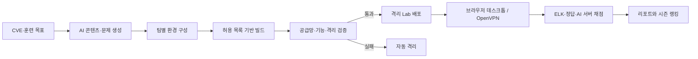

# ZeroTOP

**Zero-day Training Orchestration Platform** — AI가 만드는 실전형 사이버 레인지

최신 CVE와 훈련 목표를 입력하면 AI가 강의 자료, 취약 환경, 공격·방어 시나리오와
채점 문제까지 한 번에 생성합니다. 만들어진 환경은 실행마다 격리되고, 배포 전에
공급망·기능·격리 검증을 자동으로 통과해야 하며, 학습자의 결과는 서버가 직접
채점해 역량 리포트와 시즌 랭킹으로 이어집니다.

데모 화면만 있는 프로젝트가 아닙니다. 웹, API, AI 생성, 환경 빌드, 검증, 채점,
텔레메트리, 가상화, VPN, 관리 기능에 운영 인프라 코드까지 함께 담은
프로덕션 지향 코드베이스입니다.

## 무엇을 하는가

- **AI Lab 생성** — CVE 정보(NVD 확인)와 운영자가 승인한 컴포넌트 목록을 근거로
  학습 본문, 채점 계약, 팀별 환경 구성, 이미지 빌드 명세를 생성합니다. 모델이 짠
  빌드 명세를 그대로 믿지 않고, 신뢰된 명세를 서버가 재구성합니다.
- **블루팀 / 레드팀 훈련** — 블루팀은 브라우저 분석 데스크톱에서 실행 전용
  ELK/Kibana로 공격 흔적을 추적하고 MITRE ATT&CK에 매핑합니다. 레드팀은
  브라우저 Kali 또는 OpenVPN으로 격리된 취약 대상을 공격합니다.
- **자동 검증** — 서명, SBOM, 취약점 스캔, 기능·격리 점검, 블루팀 ELK 검색을
  모두 통과해야 배포됩니다. 하나라도 실패하면 자동 격리됩니다.
- **서버 채점과 리포트** — 정답과 채점 근거는 브라우저에 절대 내려보내지 않습니다.
  개인·조직·플랫폼 단위 역량 리포트를 제공합니다.
- **시즌 랭킹** — 난이도·정확도·소요 시간·힌트를 보정한 점수로 개인과 조직을
  순위 매깁니다. 공개는 개인·조직 각각의 동의를 받습니다.
- **회원가입과 로그인** — 이메일·비밀번호 가입과 로그인, 개인정보 수집 동의,
  조직 가입 코드까지. 운영에서는 OIDC(Keycloak)로 전환할 수 있습니다.
- **관리자 기능** — 사용자 권한 변경과 계정 정지, 조직 구성원 관리, 감사 로그
  조회, Lab 격리·해제, 실행 강제 종료, 시즌 관리.

## 기술 스택

| 영역 | 스택 |
|---|---|
| 웹 | Next.js 16, React 19, TypeScript |
| API | Node.js 24 (TypeScript 직접 실행), PostgreSQL / SQLite |
| AI | Anthropic Claude (전용 게이트웨이 경유), 엄격한 JSON Schema 계약 |
| 빌드·검증 | rootless BuildKit, Cosign / Syft / Trivy |
| 런타임 | Kubernetes, KubeVirt, Cilium, Longhorn |
| 인프라 | RKE2 3노드, Ansible, Keycloak, Elasticsearch / Kibana |

## 동작 흐름



상세 구성과 신뢰 경계는 [아키텍처 문서](docs/architecture.md)에 있습니다.

## 팀별 실습 구성

프롬프트가 셸 스크립트로 바로 실행되는 일은 없습니다. AI는 운영자가 승인한
이미지·패키지·행위 목록 안에서만 환경 구성과 검증 계약을 만들고, 검증을 통과한
실행만 학습자에게 배포됩니다.

| 구분 | 학습자 진입점 | 격리된 대상 | 문제 풀이 |
|---|---|---|---|
| 블루팀 | Ubuntu 분석 데스크톱의 브라우저 | Elastic Agent가 설치된 피해 시스템 | 실행 전용 Kibana·Elasticsearch에서 악성 행위 로그를 찾아 ATT&CK 매핑 |
| 레드팀 | Kali 브라우저 또는 OpenVPN | 취약 서비스가 배치된 별도 대상 | Kali 도구로 대상을 분석·공격하고 증거 제출 |

블루팀 시나리오는 정답용 로그를 미리 넣는 방식이 아닙니다. 승인된 행위를 피해
환경에서 재생하고, Elastic Agent가 수집한 원본 이벤트가 실행 전용 ELK에 도착하는
것까지 검증합니다. 레드팀은 Kali와 대상을 같은 VM에 두지 않고, 취약점이 해당
실행의 Kali나 VPN 대역에서만 도달하는지 확인합니다.

한 실행의 접속 방식은 브라우저 데스크톱 또는 OpenVPN 중 하나입니다. 둘을 동시에
열지 않으며, 방식을 바꾸면 기존 티켓과 프로필을 폐기하고 새로 발급합니다. 피해
시스템, 취약 대상, ELK 내부 주소는 인터넷에 직접 공개하지 않습니다.

## 빠른 시작 (로컬)

Node.js 24와 pnpm 11이면 Docker 없이 웹·API와 시뮬레이터를 띄울 수 있습니다.

```powershell
corepack enable
corepack prepare pnpm@11.9.0 --activate
pnpm install --frozen-lockfile
.\scripts\local-dev.ps1 -Mode Local
```

- 웹: `http://localhost:3000`
- API: `http://localhost:8080`
- 상태 확인: `http://localhost:8080/health`

Docker Desktop이 있으면 PostgreSQL, Keycloak, Elasticsearch/Kibana까지 함께 띄우는
`-Mode Docker`도 있습니다. 실제 취약 대상과 VM, VPN, 이미지 빌드가 포함된 전체
구성은 Kubernetes 런타임 플레인이 필요합니다. 자세한 내용은
[로컬 개발 문서](docs/local-development.md)를 참고하세요.

## 인증 모드

같은 코드가 세 가지 인증 모드로 동작합니다. `AUTH_MODE` 환경 변수로 고릅니다.

| 모드 | 용도 | 방식 |
|---|---|---|
| `dev` | 로컬 개발 | `X-User-Id` 헤더로 시드 계정 전환 |
| `local` | 무료 데모 배포 | 이메일·비밀번호 로그인, 서명된 세션 토큰 |
| `oidc` | 운영 | Keycloak OIDC 토큰 검증 |

비밀번호는 솔트를 적용한 scrypt로 저장합니다. `local` 모드는 Keycloak 없이도
가입·로그인이 되지만, 검증된 인증 인프라가 아니라 데모용입니다.

## 무료 데모 배포 (Render)

제출·시연용 라이브 링크는 Render 무료 티어에 블루프린트 하나로 올릴 수 있습니다.
`render.yaml`이 웹과 API 두 서비스를 만들고, 웹이 `/api`를 API로 프록시하므로
브라우저는 단일 도메인만 사용해 CORS 설정이 필요 없습니다. 부팅할 때 데모 데이터를
다시 채워, 재시작으로 저장소가 비어도 랭킹은 항상 표시됩니다.

절차와 배포 후 설정할 값은 [Render 데모 배포 문서](docs/render-demo-deployment.md)에
정리했습니다.

## 품질 검사

```powershell
python -m pip install -r .\services\ai\requirements.txt
pnpm check   # 타입 검사
pnpm test    # Node/Python 테스트
pnpm build   # Next.js 빌드
```

GitHub Actions도 같은 타입 검사, 테스트, 빌드, YAML 파싱을 수행합니다.

## 운영 배포에 필요한 것

저장소에는 서버 구성과 배포 코드가 있지만, 클라우드 계정·서버 주소·도메인·인증서·
이미지 레지스트리·모델 API 키는 들어 있지 않습니다. 그래서 체크아웃만으로 공개
운영 서버가 생기지는 않습니다. 운영자는 최소한 다음을 준비해야 합니다.

- KVM을 쓸 수 있는 Ubuntu 24.04 서버 또는 동급 런타임 노드
- 플랫폼·인증·데스크톱·VPN용 DNS와 인증서, OpenVPN용 UDP 로드밸런서
- 운영 PostgreSQL, Keycloak, Elasticsearch/Kibana, 백업과 비밀 관리
- 서명된 Ubuntu/Kali/검증/BuildKit 이미지와 사설 레지스트리
- 모델 API 키 (`ANTHROPIC_API_KEY`)
- 조직의 보존 기간, 허용 CVE·패키지 목록, egress 정책

순서는 [운영 배포 문서](docs/production-deployment.md), 전체 설정값은
[환경 변수 문서](docs/environment-variables.md)를 따릅니다. Kubernetes 베이스의
`example.invalid`, `replace-with-digest`, `REQUIRED_*` 값은 안전을 위한 배포 차단
값이므로 운영 오버레이에서 반드시 교체해야 합니다.

## 저장소 구조

| 경로 | 역할 |
|---|---|
| `apps/web` | 사용자·관리자 웹 (Next.js) |
| `services/api` | 인증, 권한, Lab/실행, 리포트, 랭킹, 관리자 API |
| `services/ai` | AI 생성·검토·게시 판정·주관식 루브릭 |
| `services/model-gateway` | 외부 모델(Claude)을 호출하는 유일한 컴포넌트 |
| `services/builder` | 환경 명세를 BuildKit 작업으로 빌드 |
| `services/validator` | Cosign/Syft/Trivy와 런타임 검증 |
| `services/runtime` | KubeVirt VM, 브라우저/OpenVPN 실행, 격리 점검 |
| `services/telemetry` | 실행별 Elasticsearch 인덱스와 제한된 검색 API |
| `services/grader` | ELK 근거와 AI 루브릭 기반 서버 채점 |
| `services/desktop-gateway` | 일회용 티켓 기반 noVNC 프록시 |
| `services/openvpn-issuer` | 실행별 인증서·프로필 발급 |
| `packages/*` | 공유 계약, 인증, 채점, 리포트 로직 |
| `infra/kubernetes` | 플랫폼·런타임 Kubernetes 배포 베이스 |
| `infra/server` | RKE2 3노드 서버 Ansible 구성 |

## 보안 원칙

- 학습자 환경은 실행마다 네트워크를 기본 차단하고 수명을 제한합니다. TTL이 지난
  실행은 주기적으로 회수하고, 계정을 정지하면 그 계정의 실행 환경도 함께 종료합니다.
- Kubernetes API, 클라우드 메타데이터, 플랫폼 데이터 계층, 다른 실행으로의 이동을
  막습니다.
- 정답, 루브릭, ELK API 키, VPN 개인키, 내부 토큰은 브라우저 응답에 넣지 않습니다.
- 빌더는 임의 Dockerfile이나 셸 명령을 받지 않고, digest로 고정한 이미지·패키지·
  아티팩트 허용 목록만 씁니다.
- 모델 게이트웨이는 사용자 ID·이메일·조직 ID 같은 식별자를 모델 공급자에 보내지
  않습니다.
- 감사 로그는 행위자·출처 IP·사유를 기록합니다. 관리자는 자기 자신을 강등하거나
  정지할 수 없어, 마지막 관리자가 잠기지 않습니다.
- 개발용 고정 계정·토큰과 보안이 꺼진 로컬 Elasticsearch는 외부에 노출하지
  않습니다.
