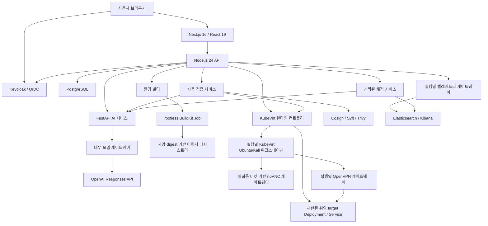

# 플랫폼 아키텍처

## 시스템 구성

웹은 공개 문제와 실행 상태만 받습니다. API는 사용자 권한, 조직 소속, Lab, 실행, 제출, 점수, 리포트, 랭킹과 감사 로그의 경계를 소유합니다. AI는 OpenAI API key를 소유하지 않고 내부 모델 게이트웨이만 호출합니다. 게이트웨이는 고정된 Responses API origin과 strict JSON schema만 사용합니다. AI, 빌더, 검증, 런타임, 채점, 텔레메트리는 서로 다른 내부 bearer token으로 호출되며 공개 브라우저에서 직접 접근하지 않습니다.

PostgreSQL이 플랫폼 상태의 source of truth입니다. Redis는 배포 토폴로지에 캐시·비동기 작업 확장 지점으로 포함되지만 현재 요청의 정합성은 Redis에 의존하지 않습니다. Elasticsearch는 블루팀 실행별 텔레메트리와 ELK 증거 채점에만 사용하며 API는 텔레메트리/채점 계약을 통해 접근합니다.

## 인증, 가입과 단일 조직 모델

Keycloak이 인증하고 API가 OIDC 서명, issuer, audience와 client를 다시 검증합니다. Realm 역할은 `individual`, `org_member`, `org_admin`, `platform_admin`이며, 실제 권한은 토큰 역할과 플랫폼 데이터베이스 역할을 함께 만족해야 합니다.

가입 흐름은 두 가지입니다.

- 개인 사용자: 조직 membership 없이 가입하고 개인 리포트와 동의 기반 전체 랭킹을 사용합니다.
- 조직 사용자: 서버가 발급한 조직 가입 코드를 제시해 `member` 또는 `org_admin` 역할로 가입합니다.

`organization_memberships.user_id`의 고유 제약으로 한 사용자는 최대 한 조직에만 속할 수 있습니다. 가입 코드는 CSPRNG로 생성하고 해시만 저장하며, 생성·회전 직후 응답에서 한 번만 평문을 반환합니다. 조직 역할만으로 다른 조직을 선택할 수 없고 모든 조직 범위 조회는 데이터베이스 membership에 고정됩니다.

## 설계·검증 흐름

1. 사용자가 팀, 난이도, CVE, 접근 방식과 목표를 프롬프트로 제출합니다.
2. AI 서비스가 요청 CVE를 NVD 고정 endpoint에서 조회하고, 운영자가 소유한 base/package/artifact catalog와 정규화된 `cveIntel`만 모델에 전달해 강의 섹션, 공개 문제, 서버 전용 채점 계약, 공격 흐름, 검증 probe와 선언형 환경 빌드 명세를 생성합니다.
3. AI 경계가 요청 CVE 범위, catalog exact membership과 `http-v1` runtime 계약을 다시 검증합니다. CVE 조회 실패, catalog 밖 좌표, 승인 component 미선택은 fail-closed 됩니다.
4. API는 공개 문제와 비공개 정답을 분리해 저장하고 빌더에 멱등 build 요청을 보냅니다.
5. 빌더는 base image, 출력 repository, 패키지, 아티팩트와 egress 허용 목록을 확인한 뒤 실행별 namespace에서 rootless BuildKit Job을 수행합니다.
6. 빌드가 끝나면 image reference와 digest, provenance, 학습 자료, 시나리오와 검증 계약을 Lab에 결합합니다.
7. 검증 서비스가 Cosign 서명, Syft SBOM, Trivy 결과와 예상 CVE를 확인하고 런타임에 일회성 검증 환경을 요청합니다.
8. 런타임은 기능·의도된 취약점 probe를 수행하고 외부 인터넷, Kubernetes API와 다른 실행 canary가 차단되는지 증명합니다. 블루팀은 임시 Elasticsearch 인덱스에서 예상 이벤트 검색까지 검사합니다.
9. AI 자동 판정은 모든 독립 증거와 필수 정책을 대조합니다. 전부 통과하면 `validated`, 하나라도 실패하면 `quarantined`가 됩니다.

자동 검증에는 사람 승인 상태가 없습니다. 플랫폼 관리자가 Lab을 별도로 격리할 수 있지만 이는 통과 판정을 대신하는 승인 기능이 아니라 사고 대응용 운영 제어입니다.

AI/빌더가 생성하는 이미지는 단일 서명 `http-v1` base에 운영자 승인 component layer/artifact만 결합한 취약 target용 일반 OCI 이미지입니다. 학습자가 접속하는 Ubuntu/Kali KubeVirt 워크스테이션은 운영자가 별도로 서명·관리하는 golden image이며 AI가 수정하지 않습니다. 두 종류를 분리해 target 취약점이 학습자 desktop이나 KubeVirt control 경계로 전파되지 않게 합니다.

### 생성 계약과 팀별 문제

- 블루팀은 `elk_search`와 `mitre_attack` 문제를 모두 포함합니다. ELK 문제의 정답은 생성한 실행별 이벤트 ID와 연결되고 MITRE 답은 허용된 technique ID와 일치해야 합니다.
- 레드팀은 `single_choice`, `multiple_choice`, `free_text`, `mitre_attack` 중 선택한 유형을 조합합니다.
- 공개 문제에는 answer key, rubric, 예상 이벤트 ID 같은 채점 재료가 포함될 수 없습니다.
- 비공개 채점 계약은 문제 ID와 일대일 대응하며 API/채점 서비스 경계 안에서만 조회합니다.
- 생성된 본문·문제와 빌드 결과의 본문·문제는 동일한 계약으로 검증해 환경과 교육 내용의 불일치를 차단합니다.

## 실습 워크스페이스

운영 런타임은 실행마다 `range-<run-id>` namespace를 만들고 다음 자원을 구성합니다.

- Ubuntu 또는 Kali 학습자 워크스테이션 KubeVirt VM
- AI 빌더가 만든 일반 OCI 취약 target 이미지의 실행별 Deployment와 ClusterIP Service
- 기본 차단 NetworkPolicy, ResourceQuota, 수명과 준비 제한 시간
- 브라우저 접근이면 workstation의 noVNC endpoint와 중앙 데스크톱 게이트웨이 경로
- OpenVPN 접근이면 해당 실행에만 존재하는 gateway Deployment와 UDP LoadBalancer
- 블루팀이면 해당 run ID로 고정된 Elasticsearch 인덱스와 제한된 검색 API

워크스테이션 VMI와 취약 target Deployment·endpoint가 모두 준비되어야 하며, 브라우저 실행은 desktop endpoint, VPN 실행은 gateway 준비 marker와 LoadBalancer 주소까지 확인합니다. 제한 시간을 넘긴 실행은 무기한 `provisioning`에 머물지 않고 실패로 전환됩니다.

### 브라우저 데스크톱

API가 60초 수명의 일회용, 사용자·실행 결합 티켓을 발급합니다. 데스크톱 게이트웨이는 내부 API에서 티켓을 교환하고 짧은 수명의 서명된 HttpOnly/Secure 쿠키를 설정한 뒤 지정된 workstation의 noVNC/WebSocket만 프록시합니다. VM console과 ClusterIP 서비스는 인터넷에 직접 공개하지 않습니다.

### OpenVPN

중앙 issuer는 PKI와 암호화된 프로필 저장을 담당하지만 터널 트래픽을 처리하거나 `NET_ADMIN` 권한을 갖지 않습니다. 런타임은 실행별 bootstrap credential을 만들고 각 namespace 안에 별도 gateway를 배치합니다. gateway는 같은 run label의 대상, DNS와 issuer bootstrap endpoint만 접근할 수 있습니다. 프로필 다운로드도 60초 일회용 티켓을 사용하며 실행 정지·만료 시 폐기됩니다.

### 블루팀 ELK 검색

배포 시 텔레메트리 서비스가 서버에서 만든 run ID 전용 인덱스를 생성하고 manifest hash로 멱등성을 확인합니다. 검색 API는 필드 허용 목록과 제한된 `simple_query_string`만 허용하고 정규식, 선행 wildcard, fuzzy 문법과 내부 manifest를 차단합니다. 학습자가 선택한 증거는 채점 서비스가 동일한 run 인덱스에서 다시 조회합니다.

## 채점, 리포트와 랭킹

단일·복수 선택과 MITRE 답은 서버 정답 계약으로 채점합니다. ELK 답은 제출된 이벤트 ID가 실행별 인덱스에 실제 존재하는지 채점 서비스가 확인하고, 주관식은 서버가 AI rubric endpoint를 호출해 증거를 생성합니다. 브라우저가 보낸 점수나 정답 판정은 신뢰하지 않습니다.

- 개인 리포트: 전체 점수, 성공률, 스킬별 점수·변화량, 최근 실행
- 조직 리포트: 조직 전체 점수, 활성 구성원, 구성원별 결과와 스킬
- 플랫폼 리포트: 전체 사용자·조직·활성 사용자, 전체 스킬, 조직별 요약
- 랭킹: 주간·월간·전체 기간, 조직 또는 전체 범위, 이전 기간 대비 순위 변화

조직 리포트와 구성원 목록은 해당 조직의 owner/org admin만 볼 수 있습니다. 플랫폼 리포트와 전체 관리자 데이터는 데이터베이스에도 `platform_admin`으로 지정된 관리자만 볼 수 있습니다. 전체 랭킹은 `global_ranking_opt_in` 사용자의 public handle만 공개합니다.

## 관리자 경계

플랫폼 관리자는 페이지가 매겨진 사용자·조직·Lab·실행 목록과 전체 현황을 조회하고 조직 생성, 가입 코드 회전, Lab 격리와 실행 강제 종료를 수행할 수 있습니다. 조직 관리자는 자기 조직 구성원과 조직 리포트만 볼 수 있습니다. 관리자 mutation은 `Idempotency-Key`를 요구하고 감사 이벤트를 기록합니다.

## 배포 토폴로지와 신뢰 경계

Docker Compose는 개발 통합 환경이며 운영 배포가 아닙니다. 운영 구성은 플랫폼 plane과 KubeVirt/OpenVPN runtime plane을 분리하고, 환경별 private overlay가 실제 이미지 digest, DNS/TLS, 데이터 endpoint, 비밀과 egress 목적지를 제공합니다.

| 경계 | 허용 트래픽 |
|---|---|
| 공개 edge | 브라우저에서 TLS 웹·OIDC·공개 API·데스크톱/VPN 다운로드 endpoint |
| 애플리케이션 | API에서 AI·빌더·검증·런타임·채점·텔레메트리로 인증된 내부 호출 |
| 데이터 | 승인된 서비스에서 PostgreSQL/Elasticsearch로 최소 권한 접근 |
| 빌드 | 빌더에서 Kubernetes API와 명시된 registry/artifact CIDR·port만 접근 |
| 런타임 제어 | API/검증 서비스에서 런타임 컨트롤러의 좁은 인증 계약만 호출 |
| Lab 네트워크 | 학습자 desktop/VPN에서 자신에게 배정된 challenge target만 접근 |

운영 overlay는 평문 Secret을 소스에 저장하지 않고 External Secrets 또는 동등한 비밀 관리 흐름을 사용해야 합니다. 이미지 digest 고정, SBOM, 서명, 스캔과 admission policy를 적용하고 PostgreSQL/Elasticsearch/etcd/Longhorn의 독립 백업과 복구 훈련을 운영합니다.
