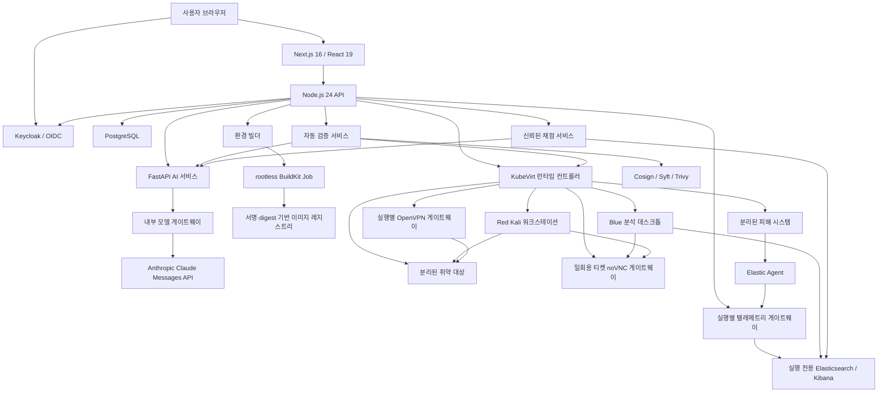
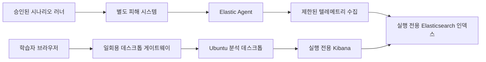
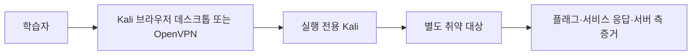

# 플랫폼 아키텍처

## 전체 그림

웹은 공개 문제와 실행 상태만 받아 보여줍니다. 사용자 권한, 조직 소속, Lab과 실행, 제출·채점, 리포트, 랭킹, 감사 로그 — 이런 건 전부 API가 쥐고 있고 웹은 그 결과만 렌더링합니다. AI 서비스는 Anthropic API 키를 직접 들고 있지 않습니다. 대신 내부 모델 게이트웨이 하나만 호출하고, 그 게이트웨이가 고정된 Anthropic Messages API 주소와 엄격한 JSON 스키마로만 통신합니다. AI, 빌더, 검증, 런타임, 채점, 텔레메트리는 서로 다른 내부 토큰으로 인증하고, 어느 것도 브라우저에서 직접 닿지 않습니다. 내부 서비스 하나가 뚫려도 나머지 경계는 그대로 남는 구조를 노린 겁니다.

정합성의 기준점은 PostgreSQL입니다. Redis는 배포 토폴로지에 캐시나 비동기 작업 확장용으로 끼워 넣을 자리는 마련해뒀지만, 지금 요청 처리 로직 어디에도 Redis에 의존하는 부분은 없습니다. Elasticsearch는 블루팀 실행의 텔레메트리와 ELK 증거 채점에만 씁니다. 학습자에게 클러스터 관리 권한을 주는 게 아니라, 자기 실행에 묶인 Kibana space와 제한된 검색 권한만 내려줍니다.

Hack The Box 같은 서비스에서 참고한 건 딱 하나, 워크스페이스와 별도 타깃을 연결하는 사용자 흐름입니다. 그 서비스들의 내부 구현을 안다고 전제하지 않고, 그대로 베끼지도 않았습니다. ZeroTOP이 다른 지점은 프롬프트 하나로 매번 검증 가능한 환경 구성을 새로 만든다는 데 있습니다.

## 인증, 가입, 그리고 한 사람은 한 조직

Keycloak이 로그인을 처리하고, API는 그걸 다시 검증합니다. 서명, issuer, audience, client — OIDC 토큰이 넘어와도 API가 한 번 더 확인합니다. Realm 역할은 `individual`, `org_member`, `org_admin`, `platform_admin` 네 가지인데, 토큰에 역할이 찍혀 있다고 바로 권한을 주지는 않습니다. 플랫폼 데이터베이스에 저장된 역할과 토큰 역할이 둘 다 맞아야 실제 권한이 열립니다.

가입은 두 갈래입니다.

- 개인 사용자는 조직 없이 가입해서 개인 리포트를 받고, 동의하면 전체 랭킹에도 이름을 올립니다.
- 조직 사용자는 서버가 발급한 가입 코드를 받아서 `member` 또는 `org_admin`으로 들어옵니다.

한 사용자가 여러 조직에 걸치는 일은 데이터베이스 제약(`organization_memberships.user_id` 유니크)으로 원천 차단했습니다. 가입 코드는 CSPRNG로 뽑고 해시만 저장하는데, 평문은 생성이나 회전 직후 응답에서 딱 한 번만 보여줍니다. 그 후엔 서버도 원래 코드를 모릅니다. 토큰에 조직 역할이 있다고 해서 다른 조직을 골라 들어갈 수는 없고, 모든 조직 범위 조회는 데이터베이스 소속 정보에 고정됩니다.

## 설계부터 검증까지

1. 사용자가 블루/레드 팀, 난이도, CVE나 행위 목표, 접속 방식과 훈련 목표를 프롬프트로 넣습니다.
2. AI 서비스가 해당 CVE를 NVD 고정 엔드포인트에서 조회하고, 운영자가 승인한 베이스·패키지·아티팩트·행위 목록과 정규화한 `cveIntel`만 모델에 넘깁니다. 모델이 직접 CVE 정보를 아는 게 아니라 서버가 확인한 정보만 받습니다.
3. AI는 강의 섹션, 공개 문제, 서버 전용 채점 계약과 함께 선언형 Lab 구성을 만듭니다. 이 구성에는 노드 역할, 승인된 이미지 좌표, 서비스와 포트, 허용 연결, 텔레메트리 소스, 시나리오 행위 ID, 예상 증거와 검증 조건이 구조화된 형태로 들어갑니다.
4. 스키마와 정책 엔진이 요청 범위, 카탈로그 소속 여부, 팀별 필수 노드, `accessMode` 단일 선택을 검사합니다. CVE 조회 실패, 카탈로그 밖 좌표, 승인 안 된 행위, 임의 셸 명령, 블루팀의 피해 시스템·에이전트 누락, 레드팀의 타깃 누락 — 이 중 하나라도 걸리면 그 자리에서 막힙니다.
5. API는 공개 문제와 비공개 정답·예상 증거를 분리 저장하고, 빌더에 멱등 빌드 요청을 보냅니다.
6. 빌더는 베이스 이미지, 출력 저장소, 패키지, 아티팩트, egress 허용 목록을 확인한 뒤 실행 전용 네임스페이스에서 rootless BuildKit Job을 돌립니다.
7. 빌드가 끝나면 이미지 참조와 digest, provenance, 학습 자료, 환경 구성, 시나리오 행위 계획, 검증 계약을 하나로 묶어 불변 Lab 리비전을 만듭니다.
8. 검증 서비스가 Cosign 서명, Syft SBOM, Trivy 결과와 예상 CVE를 확인하고, 런타임에 일회성 검증용 토폴로지를 배포합니다.
9. 런타임이 기능·의도된 취약점 점검과 격리 카나리를 돌립니다. 블루팀은 피해 환경의 에이전트 등록부터 승인된 악성 행위 재생, 수집, 실행 전용 Kibana 검색, ATT&CK 증거까지 전부 확인하고, 레드팀은 Kali 경로에서만 타깃의 의도된 서비스·취약점·플래그가 닿는지 봅니다.
10. AI 자동 판정 서비스가 독립적으로 만든 증거를 필수 정책과 대조합니다. 전부 통과하면 리비전을 `validated`로 바꿔 실제 배포를 허용하고, 하나라도 실패하면 바로 `quarantined`로 격리합니다.

자동 검증에는 사람이 승인 대기하는 단계가 없습니다. 플랫폼 관리자가 Lab을 격리할 수는 있지만, 이건 통과 판정을 대신하는 승인 절차가 아니라 사고가 났을 때 쓰는 운영 조치입니다.

AI와 빌더가 만드는 이미지는 서명된 `http-v1` 베이스에 운영자 승인 컴포넌트·아티팩트만 붙인 취약 타깃용 OCI 이미지입니다. 학습자가 접속하는 Ubuntu/Kali 워크스테이션은 이것과 완전히 다릅니다 — 운영자가 별도로 서명·관리하는 골든 이미지이고, AI가 손댈 수 없습니다. 둘을 갈라놓은 이유는 단순합니다. 타깃에 있는 취약점이 학습자 데스크톱이나 KubeVirt 제어 경계로 넘어오면 안 되니까요.

### 선언형 환경 구성 계약

AI가 뱉는 결과물은 실행 명령이 아니라 런타임이 해석하는 버전 관리 데이터입니다. 최소한 이런 정보를 담습니다.

| 필드 | 의미 |
|---|---|
| `team` | `blue` 또는 `red`. 팀별 허용 노드와 문제 유형을 결정합니다. |
| `accessMode` | `browser_desktop` 또는 `openvpn` 중 정확히 하나. |
| `nodes` | 분석 데스크톱, 피해 시스템, Kali, 취약 타깃 등 역할과 승인된 이미지 digest. |
| `services` | 실행 내부 DNS 이름, 포트, 헬스 체크와 노출 주체. |
| `networkEdges` | 출발지→도착지 최소 허용 연결. 명시하지 않은 연결은 자동으로 거부됩니다. |
| `telemetry` | Elastic Agent 인테그레이션, 데이터셋, 실행 전용 인덱스/space와 보존 기간. |
| `scenarioActions` | 승인된 행위 카탈로그 ID, 대상 노드, 순서와 안전 제한. 모델이 즉석에서 만든 셸 명령은 여기 들어갈 수 없습니다. |
| `expectedEvidence` | 예상 이벤트 카테고리, 필수 필드, ATT&CK 기법과 시간 범위. |
| `validationProbes` | 기능·취약점·수집·검색·격리·정리 완료 조건. |

리비전 해시는 콘텐츠, 문제, 환경 구성, 이미지 digest, 행위 계획, 검증 계약을 전부 묶습니다. 배포 시점에 이 중 하나라도 바뀌면 예전 검증 결과를 재사용하지 않고 새 리비전으로 처음부터 다시 검증합니다.

### 생성 계약과 팀별 문제

- 블루팀은 `elk_search`와 `mitre_attack` 문제를 반드시 함께 냅니다. ELK 문제의 정답은 그 실행에서 실제로 생성된 이벤트 ID와 연결되고, MITRE 답은 허용된 기법 ID와 정확히 일치해야 합니다.
- 레드팀은 `single_choice`, `multiple_choice`, `free_text`, `mitre_attack` 중에서 골라 조합합니다.
- 공개 문제에는 정답, 루브릭, 예상 이벤트 ID 같은 채점 재료가 아예 들어갈 수 없습니다.
- 비공개 채점 계약은 문제 ID와 일대일로 묶이고, API와 채점 서비스 경계 안에서만 조회됩니다.
- 생성된 콘텐츠와 문제, 실제 빌드 결과의 콘텐츠와 문제는 같은 계약으로 검증합니다. 환경과 교육 내용이 서로 어긋나는 상황을 막기 위해서입니다.

## 실습 워크스페이스

운영 런타임은 실행마다 `range-<run-id>` 네임스페이스를 새로 만들고 그 안에 필요한 자원을 구성합니다.

- 블루팀: Ubuntu 분석 워크스테이션, 실행 전용 ELK 테넌트, Elastic Agent가 설치된 별도 피해 시스템, 승인된 시나리오 행위 러너
- 레드팀: Kali 워크스테이션, AI 빌더가 만든 별도 취약 타깃(VM/Deployment와 ClusterIP Service)
- 기본 차단 NetworkPolicy, ResourceQuota, 수명과 준비 시간 제한
- `browser_desktop`이면 워크스테이션의 noVNC 엔드포인트와 중앙 데스크톱 게이트웨이 경로
- `openvpn`이면 해당 실행에만 존재하는 게이트웨이 Deployment와 UDP LoadBalancer

블루팀은 분석 데스크톱, Kibana space, 피해 시스템, 에이전트 등록, 시나리오 증거 수집까지 전부 준비돼야 실행이 시작됩니다. 레드팀은 Kali 진입점과 취약 타깃 엔드포인트가 둘 다 준비돼야 합니다. 브라우저 실행이면 데스크톱 엔드포인트를, VPN 실행이면 게이트웨이 준비 마커와 LoadBalancer 주소까지 추가로 확인합니다. 준비 시간을 넘긴 실행은 `provisioning` 상태로 무한정 머물지 않고 실패로 처리됩니다.

### 블루팀 구성과 로그 생성

블루팀 실행은 학습자가 쓰는 분석 환경과 관측 대상 환경을 물리적으로 분리합니다.

- 분석 데스크톱에는 그 실행 전용 Kibana URL이 미리 설정돼 있고, 학습자는 브라우저에서 로그를 검색해 증거 이벤트를 고릅니다.
- 피해 시스템은 분석 데스크톱과 완전히 다른 VM/Pod입니다. 서비스, 사용자, 파일, 기본 로그까지 시나리오용으로 미리 세팅됩니다.
- Elastic Agent는 단기 등록 토큰과 실행 라벨로 등록되고, 피해 시스템의 엔드포인트/시스템/애플리케이션 로그만 실행 전용 데이터셋으로 보냅니다.
- 시나리오 러너는 AI가 즉석에서 만든 명령이 아니라, 운영자가 미리 승인한 행위 ID를 안전 제한 안에서 실행합니다. 행위는 피해 시스템에서 실제로 벌어지고 에이전트가 그 결과를 수집하는 구조라서, 정답용 이벤트를 Elasticsearch에 바로 꽂아 넣는 방식과는 근본적으로 다릅니다.
- 배경 로그와 시나리오 악성 행위 로그 전부에 실행 ID, 시나리오 리비전, 이벤트 시각이 붙습니다. 정답 계약은 공개되지 않은 예상 증거와 MITRE ATT&CK 기법을 참조합니다.
- 클러스터는 공유해도 인덱스, data view, Kibana space, API 키, 보존 정책은 실행 단위로 갈라둡니다. 다른 실행의 인덱스 패턴이나 Fleet 자격 증명에는 접근할 수 없습니다.

### 레드팀 구성

Kali는 운영자가 관리하는 골든 이미지이고, 취약점은 전부 별도 타깃 쪽에 몰아넣습니다. 환경 구성이 선언한 DNS와 포트만 Kali에서 타깃으로 허용되고, 타깃은 인터넷도, 플랫폼 API도, Kubernetes API도, 다른 실행도 접근할 수 없습니다. 자동 검증은 의도한 취약점 재현 여부와 의도하지 않은 확산 여부를 같이 봅니다. 요청한 취약점은 정확히 재현되면서, 그게 제어 평면이나 다른 환경으로 새지 않는지를 확인하는 겁니다.

OpenVPN 모드에서는 학습자가 자기 장비를 그 실행의 네트워크에 직접 연결하고 타깃에 접근합니다. 별도 Kali VM이 필요한 시나리오는 VPN 안에서만 닿는 Kali 점프 호스트로 제공하고, 필요 없는 시나리오는 학습자 장비가 타깃에 바로 연결되도록 구성이 알아서 정해줍니다.

### 접속 방식은 하나만

한 실행의 `accessMode`는 `browser_desktop`과 `openvpn` 중 하나만 가질 수 있습니다. API는 선택된 방식의 티켓이나 프로필만 발급하고, 둘 다 열어주는 경우는 없습니다. 실행 도중 방식을 바꾸려면 기존 데스크톱 세션 쿠키·티켓이나 VPN 인증서·프로필을 먼저 폐기하고 게이트웨이를 정리한 다음, 새 방식의 준비 검사를 통과해야 합니다. 이렇게 해둔 이유는 간단합니다 — 두 진입점을 동시에 열어두면 그 자체가 우회 경로가 됩니다.

### 브라우저 데스크톱

API는 기본 5분짜리 일회용 티켓을 발급합니다. 사용자와 실행에 결합된 티켓이고, 유효시간은 `DESKTOP_TICKET_TTL_SECONDS`로 조정할 수 있습니다. 데스크톱 게이트웨이는 첫 요청에서 이 티켓을 교환한 뒤 URL에서 지워버리고, 대신 서명된 HttpOnly/Secure 쿠키를 심습니다. 이후로는 그 쿠키로만 지정된 분석 데스크톱이나 Kali의 noVNC/WebSocket을 프록시합니다.

여기서 헷갈리기 쉬운 부분이 있는데, 쿠키 만료는 실행 만료 시각과 `DESKTOP_SESSION_MAX_MINUTES` 중 더 이른 쪽으로 정해집니다. 그래서 티켓 자체의 5분이 지나도 이미 들어간 데스크톱이나 ELK 연결이 바로 끊기지는 않습니다. 실행이 살아있는 동안은 새로고침하든 Kibana를 계속 쓰든 문제없습니다. 반대로 실행이 끝나거나 TTL이 만료되면 쿠키가 남아있어도 게이트웨이가 거부합니다. 티켓을 아직 안 썼는데 5분이 지났다면 그냥 다시 워크스페이스 열기를 누르면 새 티켓이 나옵니다. 블루팀 데스크톱 브라우저에는 `http://kibana:5601`과 실행 전용 Kibana가 미리 준비돼 있고, 레드팀 데스크톱에는 타깃 DNS와 Kali 도구가 세팅돼 있습니다. VM 콘솔과 ClusterIP 서비스는 인터넷에 직접 노출하지 않습니다.

### OpenVPN

중앙 issuer는 PKI와 암호화된 프로필 저장을 맡을 뿐, 실제 터널 트래픽을 처리하거나 `NET_ADMIN` 권한을 갖지는 않습니다. 런타임이 실행별 부트스트랩 크리덴셜을 만들고, 각 네임스페이스 안에 게이트웨이를 따로 배치합니다. 게이트웨이는 같은 실행 라벨의 환경 구성에 명시된 대상, DNS, issuer 부트스트랩 엔드포인트만 접근할 수 있습니다. 프로필 다운로드도 60초짜리 일회용 티켓을 씁니다. 실행이 끝나거나 만료되면 바로 폐기됩니다. OpenVPN이 켜진 실행에는 브라우저 데스크톱 진입점을 아예 만들지 않습니다.

### 블루팀 ELK 검색

배포 시점에 텔레메트리 서비스가 그 실행 ID 전용 인덱스, data view, Kibana space를 만들고, manifest 해시로 멱등성을 확인합니다. Elastic Agent가 등록되고 첫 하트비트가 확인된 뒤에야 시나리오 행위를 재생하고, 예상 이벤트가 실제 수집 파이프라인을 거쳐 검색될 때만 준비 완료로 넘어갑니다. 검색 API는 필드 허용 목록과 제한된 `simple_query_string`만 받고, 정규식이나 선행 와일드카드, fuzzy 문법, 내부 manifest 접근은 차단합니다. 학습자가 고른 증거는 채점 서비스가 같은 실행 인덱스에서 다시 조회해 검증합니다.

## 채점, 리포트, 랭킹

단일·복수 선택과 MITRE 답은 서버가 가진 정답 계약으로 채점합니다. ELK 답은 제출된 이벤트 ID가 그 실행 인덱스에 실제로 존재하는지 채점 서비스가 확인하고, 주관식은 서버가 AI 루브릭 엔드포인트를 호출해 판정 증거를 만듭니다. 브라우저가 보낸 점수나 정답 판정은 어떤 경우에도 그대로 믿지 않습니다.

- 개인 리포트: 전체 점수, 성공률, 스킬별 점수와 변화량, 최근 실행 이력
- 조직 리포트: 조직 전체 점수, 활성 구성원, 구성원별 결과와 스킬
- 플랫폼 리포트: 전체 사용자·조직·활성 사용자 수, 전체 스킬, 조직별 요약
- 시즌 랭킹: 난이도 배수·정확도·시간 보너스·힌트 감점을 반영한 점수로 개인과 조직 순위를 매기고, 이전 기간 대비 변동을 보여줍니다

조직 리포트와 구성원 목록은 그 조직의 owner나 org admin만 볼 수 있습니다. 플랫폼 리포트와 전체 관리자 데이터는 데이터베이스에도 `platform_admin`으로 등록된 관리자만 볼 수 있습니다. 개인 랭킹은 `global_ranking_opt_in`에 동의한 사용자의 공개 핸들만 노출하고, 조직 종합 랭킹도 마찬가지로 조직이 직접 공개 동의를 해야 순위표에 이름이 오릅니다.

## 관리자 경계

플랫폼 관리자는 사용자·조직·Lab·실행 목록과 전체 현황을 조회하고, 조직 생성과 가입 코드 회전, Lab 격리와 해제, 실행 강제 종료, 사용자 권한 변경과 계정 정지, 시즌 관리까지 할 수 있습니다. 조직 관리자는 자기 조직 구성원과 조직 리포트만 볼 수 있고, 다른 조직 데이터는 애초에 조회 대상에 들어오지 않습니다. 관리자가 하는 변경 작업은 전부 `Idempotency-Key`를 요구하고 감사 이벤트를 남깁니다. 자기 자신을 강등하거나 정지하는 건 막아뒀는데, 마지막 관리자가 실수로 자기 권한을 지워서 아무도 못 들어가는 상황을 피하기 위해서입니다.

## 배포 토폴로지와 신뢰 경계

Docker Compose는 개발 통합 환경일 뿐 운영 배포가 아닙니다. 실제 운영 구성은 플랫폼 plane과 KubeVirt/OpenVPN 런타임 plane을 분리하고, 환경별 private overlay가 실제 이미지 digest, DNS/TLS, 데이터 엔드포인트, 비밀, egress 목적지를 채워 넣습니다.

| 경계 | 허용 트래픽 |
|---|---|
| 공개 edge | 브라우저의 TLS 웹, OIDC, 공개 API, 데스크톱/VPN 다운로드 엔드포인트 |
| 애플리케이션 | API에서 AI·빌더·검증·런타임·채점·텔레메트리로 가는 인증된 내부 호출 |
| 데이터 | 승인된 서비스에서 PostgreSQL/Elasticsearch로 가는 최소 권한 접근 |
| 빌드 | 빌더에서 Kubernetes API와 지정된 registry/artifact CIDR·포트로만 |
| 런타임 제어 | API/검증 서비스에서 런타임 컨트롤러의 좁은 인증 계약으로만 |
| Lab ingress | 실행마다 브라우저 데스크톱 또는 OpenVPN 하나만 켜고, 사용자·실행·TTL에 결합 |
| 블루 Lab | 분석 데스크톱→Kibana, 시나리오 러너→피해 시스템, 피해 시스템 Elastic Agent→텔레메트리 수집만 |
| 레드 Lab | Kali/VPN→해당 실행 타깃의 선언된 포트만 |
| 공통 격리 | 피해 시스템/타깃에서 인터넷·플랫폼 API·Kubernetes API·메타데이터·다른 실행으로 가는 연결은 전부 거부 |

각 실행의 네임스페이스, 서비스 계정, NetworkPolicy, Elastic API 키, Kibana space, 데스크톱 티켓과 VPN 인증서는 같은 실행 라벨로 묶여 있습니다. 종료되거나 TTL이 만료되면 ingress 자격 증명을 먼저 폐기하고, 그다음에 워크로드와 인덱스/space를 보존 정책에 따라 정리합니다. 운영 overlay는 평문 Secret을 소스에 저장하지 않고 External Secrets 같은 비밀 관리 흐름을 씁니다. 이미지 digest 고정, SBOM, 서명, 스캔, admission policy를 적용하고, PostgreSQL/Elasticsearch/etcd/Longhorn은 각자 독립적으로 백업하고 복구 훈련도 따로 돌립니다.
