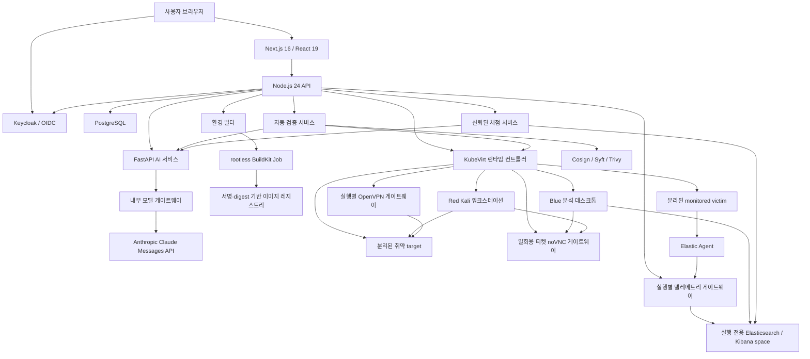
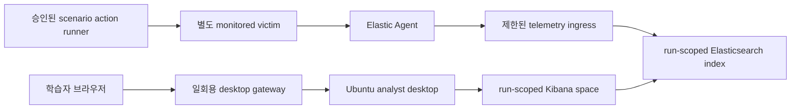
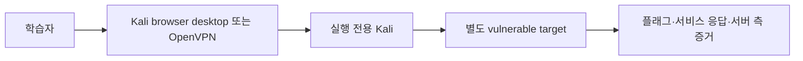

# 플랫폼 아키텍처

## 시스템 구성

웹은 공개 문제와 실행 상태만 받습니다. API는 사용자 권한, 조직 소속, Lab, 실행, 제출, 점수, 리포트, 랭킹과 감사 로그의 경계를 소유합니다. AI는 Anthropic API key를 소유하지 않고 내부 모델 게이트웨이만 호출합니다. 게이트웨이는 고정된 Anthropic Messages API origin과 strict JSON schema만 사용합니다. AI, 빌더, 검증, 런타임, 채점, 텔레메트리는 서로 다른 내부 bearer token으로 호출되며 공개 브라우저에서 직접 접근하지 않습니다.

PostgreSQL이 플랫폼 상태의 source of truth입니다. Redis는 배포 토폴로지에 캐시·비동기 작업 확장 지점으로 포함되지만 현재 요청의 정합성은 Redis에 의존하지 않습니다. Elasticsearch는 블루팀 실행별 텔레메트리와 ELK 증거 채점에만 사용하며 API는 텔레메트리/채점 계약을 통해 접근합니다. 학습자는 공용 Elasticsearch 관리 권한을 받지 않고 자신의 run에 묶인 Kibana space와 제한된 검색 권한만 받습니다.

Hack The Box 등 외부 서비스는 공개 화면에서 확인할 수 있는 **학습자 워크스페이스와 별도 target을 연결하는 UX 패턴**만 참고합니다. 비공개 인프라나 내부 구현을 알고 있거나 ZeroTOP과 동일하다고 전제하지 않습니다. ZeroTOP은 프롬프트를 검증 가능한 선언형 topology로 변환하여 매번 환경을 구성하는 제품 흐름을 독자적으로 정의합니다.

## 인증, 가입과 단일 조직 모델

Keycloak이 인증하고 API가 OIDC 서명, issuer, audience와 client를 다시 검증합니다. Realm 역할은 `individual`, `org_member`, `org_admin`, `platform_admin`이며, 실제 권한은 토큰 역할과 플랫폼 데이터베이스 역할을 함께 만족해야 합니다.

가입 흐름은 두 가지입니다.

- 개인 사용자: 조직 membership 없이 가입하고 개인 리포트와 동의 기반 전체 랭킹을 사용합니다.
- 조직 사용자: 서버가 발급한 조직 가입 코드를 제시해 `member` 또는 `org_admin` 역할로 가입합니다.

`organization_memberships.user_id`의 고유 제약으로 한 사용자는 최대 한 조직에만 속할 수 있습니다. 가입 코드는 CSPRNG로 생성하고 해시만 저장하며, 생성·회전 직후 응답에서 한 번만 평문을 반환합니다. 조직 역할만으로 다른 조직을 선택할 수 없고 모든 조직 범위 조회는 데이터베이스 membership에 고정됩니다.

## 설계·검증 흐름

1. 사용자가 Blue/Red 팀, 난이도, CVE 또는 행위 목표, 접속 방식과 훈련 목표를 프롬프트로 제출합니다.
2. AI 서비스가 요청 CVE를 NVD 고정 endpoint에서 조회하고, 운영자가 소유한 base/package/artifact/action catalog와 정규화된 `cveIntel`만 모델에 전달합니다.
3. AI는 강의 섹션, 공개 문제, 서버 전용 채점 계약과 함께 **선언형 Lab topology**를 생성합니다. topology는 노드 역할, 승인 이미지 좌표, 서비스·포트, 허용 연결, telemetry source, 시나리오 행위 ID, 예상 증거와 검증 probe를 구조화해 표현합니다.
4. schema와 정책 엔진이 요청 범위, catalog exact membership, 팀별 필수 노드와 `accessMode` 단일 선택을 검사합니다. CVE 조회 실패, catalog 밖 좌표, 승인되지 않은 행위, 임의 shell, Blue victim/agent 누락 또는 Red target 누락은 fail-closed 됩니다.
5. API는 공개 문제와 비공개 정답·예상 증거를 분리해 저장하고 빌더에 멱등 build 요청을 보냅니다.
6. 빌더는 base image, 출력 repository, 패키지, 아티팩트와 egress 허용 목록을 확인한 뒤 실행별 namespace에서 rootless BuildKit Job을 수행합니다.
7. 빌드가 끝나면 image reference와 digest, provenance, 학습 자료, topology, 시나리오 행위 계획과 검증 계약을 하나의 불변 Lab revision으로 결합합니다.
8. 검증 서비스가 Cosign 서명, Syft SBOM, Trivy 결과와 예상 CVE를 확인하고 런타임에 일회성 검증 topology를 배포합니다.
9. 런타임은 기능·의도된 취약점 probe와 격리 canary를 수행합니다. Blue는 피해 환경의 agent 등록부터 승인된 악성 행위 재생, 수집, 실행 전용 Kibana 검색과 ATT&CK 증거까지 확인하고, Red는 Kali 경로에서만 target의 의도된 서비스·취약점·플래그가 도달하는지 확인합니다.
10. AI 자동 판정 서비스가 구조화된 독립 증거와 필수 정책을 대조합니다. 전부 통과하면 불변 revision을 `validated`로 표시하여 실제 실행 배포를 허용하고, 하나라도 실패하면 `quarantined`로 격리합니다.

자동 검증에는 사람 승인 상태가 없습니다. 플랫폼 관리자가 Lab을 별도로 격리할 수 있지만 이는 통과 판정을 대신하는 승인 기능이 아니라 사고 대응용 운영 제어입니다.

AI/빌더가 생성하는 이미지는 단일 서명 `http-v1` base에 운영자 승인 component layer/artifact만 결합한 취약 target용 일반 OCI 이미지입니다. 학습자가 접속하는 Ubuntu/Kali KubeVirt 워크스테이션은 운영자가 별도로 서명·관리하는 golden image이며 AI가 수정하지 않습니다. 두 종류를 분리해 target 취약점이 학습자 desktop이나 KubeVirt control 경계로 전파되지 않게 합니다.

### 선언형 topology 계약

AI 출력은 배포 명령이 아니라 런타임이 해석하는 버전이 지정된 데이터 계약입니다. 최소 계약은 다음 정보를 포함합니다.

| 필드 | 의미 |
|---|---|
| `team` | `blue` 또는 `red`; 팀별 허용 노드와 문제 유형을 결정 |
| `accessMode` | `browser_desktop` 또는 `openvpn` 중 정확히 하나 |
| `nodes` | 분석 desktop, monitored victim, Kali, vulnerable target 등 역할과 승인된 image digest |
| `services` | run 내부 DNS 이름, 포트, health probe와 노출 주체 |
| `networkEdges` | source→destination 최소 허용 연결; 명시하지 않은 연결은 거부 |
| `telemetry` | Elastic Agent integration, dataset, 실행 전용 index/space와 보존 시간 |
| `scenarioActions` | 승인된 행위 catalog ID, 대상 노드, 순서와 안전 제한; 임의 모델 생성 shell은 금지 |
| `expectedEvidence` | 예상 event category, 필수 필드, ATT&CK technique과 시간 범위 |
| `validationProbes` | 기능, 취약점, 수집, 검색, 격리와 정리 완료 조건 |

revision hash는 콘텐츠·문제·topology·이미지 digest·행위 계획·검증 계약을 함께 묶습니다. 배포 시 이 중 하나라도 바뀌면 이전 검증을 재사용하지 않고 새 revision으로 다시 자동 검증합니다.

### 생성 계약과 팀별 문제

- 블루팀은 `elk_search`와 `mitre_attack` 문제를 모두 포함합니다. ELK 문제의 정답은 생성한 실행별 이벤트 ID와 연결되고 MITRE 답은 허용된 technique ID와 일치해야 합니다.
- 레드팀은 `single_choice`, `multiple_choice`, `free_text`, `mitre_attack` 중 선택한 유형을 조합합니다.
- 공개 문제에는 answer key, rubric, 예상 이벤트 ID 같은 채점 재료가 포함될 수 없습니다.
- 비공개 채점 계약은 문제 ID와 일대일 대응하며 API/채점 서비스 경계 안에서만 조회합니다.
- 생성된 본문·문제와 빌드 결과의 본문·문제는 동일한 계약으로 검증해 환경과 교육 내용의 불일치를 차단합니다.

## 실습 워크스페이스

운영 런타임은 실행마다 `range-<run-id>` namespace를 만들고 다음 자원을 구성합니다.

- Blue Team: Ubuntu 분석 워크스테이션, 실행 전용 ELK tenant, Elastic Agent가 설치된 별도 monitored victim과 승인된 시나리오 행위 runner
- Red Team: Kali 워크스테이션과 AI 빌더가 만든 별도 vulnerable target VM/Deployment·ClusterIP Service
- 기본 차단 NetworkPolicy, ResourceQuota, 수명과 준비 제한 시간
- `browser_desktop`이면 workstation의 noVNC endpoint와 중앙 데스크톱 게이트웨이 경로
- `openvpn`이면 해당 실행에만 존재하는 gateway Deployment와 UDP LoadBalancer

Blue는 분석 desktop, Kibana space, victim, agent enrollment, 시나리오 증거 수집이 모두 준비되어야 합니다. Red는 Kali 진입점과 취약 target endpoint가 모두 준비되어야 합니다. 브라우저 실행은 desktop endpoint를, VPN 실행은 gateway 준비 marker와 LoadBalancer 주소를 추가로 확인합니다. 제한 시간을 넘긴 실행은 무기한 `provisioning`에 머물지 않고 실패로 전환됩니다.

### Blue Team topology와 로그 생성

Blue Team 실행은 학습자가 사용하는 분석 환경과 관측 대상 환경을 분리합니다.

- analyst desktop에는 실행 전용 Kibana URL이 사전 구성되며, 학습자는 브라우저에서 로그를 검색하고 증거 event를 선택합니다.
- victim은 analyst desktop과 다른 VM/Pod이며, 서비스·사용자·파일과 baseline 로그가 시나리오 seed로 준비됩니다.
- Elastic Agent는 단기 enrollment token과 run label로 등록되고 victim의 endpoint/system/application 로그만 실행 전용 dataset으로 보냅니다.
- scenario runner는 AI가 만든 임의 명령이 아니라 운영자가 승인한 action ID를 안전 제한 안에서 실행합니다. 행위는 victim에서 발생하고 agent가 결과를 수집하므로, 정답용 이벤트를 Elasticsearch에 직접 삽입하는 방식과 구분합니다.
- 정상 배경 로그와 시나리오 악성 행위 로그에는 모두 run ID·scenario revision·event time이 부여됩니다. 정답 계약은 공개되지 않은 예상 증거와 MITRE ATT&CK technique을 참조합니다.
- 공유 Elastic cluster를 사용하더라도 index, data view, Kibana space, API key와 보존 정책은 run 단위로 분리합니다. 다른 run의 index pattern과 Fleet 자격 증명에는 접근할 수 없습니다.

### Red Team topology

Kali는 운영자가 관리하는 golden image이고 취약점은 별도 target에만 배치합니다. topology가 선언한 DNS·포트만 Kali에서 target으로 허용하며, target은 인터넷·플랫폼 API·Kubernetes API·다른 run에 접근할 수 없습니다. 자동 검증은 target의 intended-vulnerable probe와 intended-safe probe를 함께 수행해 요청한 취약점은 재현되지만 control plane이나 다른 환경으로 확장되지 않는지 확인합니다.

OpenVPN 모드에서 학습자는 자기 장비를 해당 run 네트워크에 연결하고 target에 직접 접근할 수 있습니다. 이때 별도 Kali VM이 필요한 시나리오는 VPN 안에서만 접근되는 Kali jump host로 제공하고, 필요하지 않은 시나리오는 학습자 장비가 target에 바로 연결되도록 topology가 결정합니다.

### 단일 활성 접속 방식

한 run의 `accessMode`는 `browser_desktop`과 `openvpn` 중 하나만 가질 수 있습니다. API는 선택된 방식의 ticket 또는 profile만 발급합니다. 실행 중 방식을 전환하려면 기존 desktop session cookie·ticket 또는 VPN certificate·profile을 폐기하고 gateway를 정리한 다음 새 방식의 준비 검사를 통과해야 합니다. 두 ingress를 동시에 열어 우회 경로를 만들지 않습니다.

### 브라우저 데스크톱

API가 기본 5분 수명의 일회용, 사용자·실행 결합 티켓을 발급합니다. 이 입장 시간은 `DESKTOP_TICKET_TTL_SECONDS`로 조정할 수 있습니다. 데스크톱 게이트웨이는 첫 요청에서 티켓을 교환하고 URL에서 티켓을 제거한 뒤 서명된 HttpOnly/Secure 쿠키를 설정하여 지정된 analyst desktop 또는 Kali의 noVNC/WebSocket만 프록시합니다. 쿠키의 만료는 run 만료 시각과 `DESKTOP_SESSION_MAX_MINUTES` 중 더 이른 값으로 제한되므로, 티켓의 5분 유효시간이 지나도 이미 입장한 데스크톱과 ELK 연결은 run이 활성 상태인 동안 유지됩니다. Blue desktop의 브라우저에는 run 내부에서만 해석되는 `http://kibana:5601`과 run-scoped Kibana가, Red desktop에는 target DNS와 Kali 도구가 준비됩니다. VM console과 ClusterIP 서비스는 인터넷에 직접 공개하지 않습니다.

### OpenVPN

중앙 issuer는 PKI와 암호화된 프로필 저장을 담당하지만 터널 트래픽을 처리하거나 `NET_ADMIN` 권한을 갖지 않습니다. 런타임은 실행별 bootstrap credential을 만들고 각 namespace 안에 별도 gateway를 배치합니다. gateway는 같은 run label의 topology에 명시된 대상, DNS와 issuer bootstrap endpoint만 접근할 수 있습니다. 프로필 다운로드도 60초 일회용 티켓을 사용하며 실행 정지·만료 시 폐기됩니다. OpenVPN이 활성화된 run에는 브라우저 desktop ingress를 만들지 않습니다.

### 블루팀 ELK 검색

배포 시 텔레메트리 서비스가 서버에서 만든 run ID 전용 인덱스, data view와 Kibana space를 생성하고 manifest hash로 멱등성을 확인합니다. Elastic Agent enrollment와 최초 heartbeat가 확인된 뒤 scenario action을 재생하며, 예상 이벤트가 실제 수집 파이프라인을 거쳐 검색될 때만 준비 완료로 전환합니다. 검색 API는 필드 허용 목록과 제한된 `simple_query_string`만 허용하고 정규식, 선행 wildcard, fuzzy 문법과 내부 manifest를 차단합니다. 학습자가 선택한 증거는 채점 서비스가 동일한 run 인덱스에서 다시 조회합니다.

## 채점, 리포트와 랭킹

단일·복수 선택과 MITRE 답은 서버 정답 계약으로 채점합니다. ELK 답은 제출된 이벤트 ID가 실행별 인덱스에 실제 존재하는지 채점 서비스가 확인하고, 주관식은 서버가 AI rubric endpoint를 호출해 증거를 생성합니다. 브라우저가 보낸 점수나 정답 판정은 신뢰하지 않습니다.

- 개인 리포트: 전체 점수, 성공률, 스킬별 점수·변화량, 최근 실행
- 조직 리포트: 조직 전체 점수, 활성 구성원, 구성원별 결과와 스킬
- 플랫폼 리포트: 전체 사용자·조직·활성 사용자, 전체 스킬, 조직별 요약
- 랭킹: 주간·월간·전체 기간, 조직 또는 전체 범위, 이전 기간 대비 순위 변화

조직 리포트와 구성원 목록은 해당 조직의 owner/org admin만 볼 수 있습니다. 플랫폼 리포트와 전체 관리자 데이터는 데이터베이스에도 `platform_admin`으로 지정된 관리자만 볼 수 있습니다. 전체 랭킹은 `global_ranking_opt_in` 사용자의 public handle만 공개합니다.

## 관리자 경계

플랫폼 관리자는 페이지가 매겨진 사용자·조직·Lab·실행 목록과 전체 현황을 조회하고 조직 생성, 가입 코드 회전, Lab 격리와 실행 강제 종료를 수행할 수 있습니다. 조직 관리자는 자기 조직 구성원과 조직 리포트만 볼 수 있습니다. 관리자 mutation은 `Idempotency-Key`를 요구하고 감사 이벤트를 기록합니다.

## 배포 토폴로지와 신뢰 경계

Docker Compose는 개발 통합 환경이며 운영 배포가 아닙니다. 운영 구성은 플랫폼 plane과 KubeVirt/OpenVPN runtime plane을 분리하고, 환경별 private overlay가 실제 이미지 digest, DNS/TLS, 데이터 endpoint, 비밀과 egress 목적지를 제공합니다.

| 경계 | 허용 트래픽 |
|---|---|
| 공개 edge | 브라우저에서 TLS 웹·OIDC·공개 API·데스크톱/VPN 다운로드 endpoint |
| 애플리케이션 | API에서 AI·빌더·검증·런타임·채점·텔레메트리로 인증된 내부 호출 |
| 데이터 | 승인된 서비스에서 PostgreSQL/Elasticsearch로 최소 권한 접근 |
| 빌드 | 빌더에서 Kubernetes API와 명시된 registry/artifact CIDR·port만 접근 |
| 런타임 제어 | API/검증 서비스에서 런타임 컨트롤러의 좁은 인증 계약만 호출 |
| Lab ingress | run마다 브라우저 desktop 또는 OpenVPN 하나만 활성화하고 사용자·run·TTL에 결합 |
| Blue Lab | analyst→Kibana, scenario runner→victim, victim Elastic Agent→telemetry ingress만 허용 |
| Red Lab | Kali/VPN→해당 run target의 선언된 포트만 허용 |
| 공통 격리 | victim/target에서 인터넷·플랫폼 API·Kubernetes API·metadata·다른 run으로의 연결 거부 |

각 run의 namespace, service account, NetworkPolicy, Elastic API key, Kibana space, desktop ticket와 VPN certificate는 동일한 run label에 묶입니다. 종료 또는 TTL 만료 시 ingress 자격 증명을 먼저 폐기하고 workload·index/space를 보존 정책에 따라 정리합니다. 운영 overlay는 평문 Secret을 소스에 저장하지 않고 External Secrets 또는 동등한 비밀 관리 흐름을 사용해야 합니다. 이미지 digest 고정, SBOM, 서명, 스캔과 admission policy를 적용하고 PostgreSQL/Elasticsearch/etcd/Longhorn의 독립 백업과 복구 훈련을 운영합니다.
