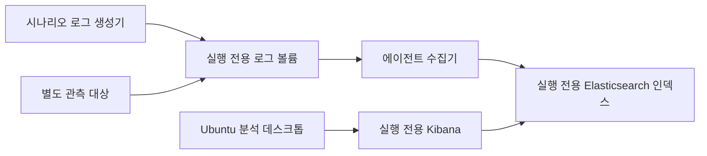

# 로컬 Docker 데스크톱 런타임

`Desktop` 모드는 웹과 API를 Windows에서 그대로 돌리면서, Docker Desktop으로 실행마다 폐기 가능한 실습 환경을 만들어줍니다. 브라우저가 컨테이너 포트에 직접 붙는 게 아니라, API가 발급한 일회용 티켓을 desktop gateway가 교환해준 다음 그 게이트웨이가 실행 내부 Docker 네트워크의 데스크톱 HTTP/WebSocket만 프록시하는 구조입니다.

## 시작하기

```powershell
.\scripts\stop-local.ps1
.\scripts\local-dev.ps1 -Mode Desktop -WebPort 3000 -ApiPort 18080 -SkipInstall
```

`http://localhost:3000`을 열어서 Lab을 고르고, 접속 방식을 **브라우저 데스크톱**으로 배포합니다. 상태가 `ready`로 바뀌면 **워크스페이스 열기**를 누르면 됩니다. 처음 실행할 때는 Ubuntu/Kali와 팀별 런타임 이미지를 새로 받아오느라 시간이 좀 걸릴 수 있습니다 — 이후로는 로컬 캐시를 재사용해서 훨씬 빠릅니다. 로그와 프로세스 정보는 `scripts/.runtime/`에 쌓입니다.

### 화면에서 블루팀 ELK 여는 순서

1. ZeroTOP 왼쪽 메뉴에서 **실습 워크스페이스**를 선택합니다.
2. 블루팀 Lab을 고르고 접속 방식을 **브라우저 데스크톱**으로 배포합니다.
3. 실행 상태가 `ready`가 되면 **워크스페이스 열기**를 누릅니다.
4. 열린 Ubuntu SOC 데스크톱에서 브라우저를 켜고 주소창에 `http://kibana:5601`을 입력합니다.
5. Kibana의 **Analytics → Discover**에서 그 Lab용으로 만들어진 data view를 골라 로그를 검색합니다.

`http://kibana:5601`은 그 실행의 격리된 Docker 네트워크 안에서만 풀리는 내부 주소입니다. Windows에서 쓰는 Chrome/Edge 주소창이나 ZeroTOP이 아닌 일반 브라우저 탭에 그대로 넣으면 당연히 안 열립니다 — 이건 버그가 아니라 원래 그렇게 설계된 겁니다. 참고로 `http://localhost:5601`은 Docker 통합 모드에서 공용으로 쓰는 개발 Kibana 주소라서, `Desktop` 모드의 실행 전용 Kibana와는 다른 주소입니다. 이 둘을 헷갈리는 경우가 은근히 많습니다.

### 일회용 티켓과 계속 유지되는 세션은 다르다

**워크스페이스 열기**가 만들어주는 URL에 붙은 `ticket`은 데스크톱에 처음 들어갈 때 딱 한 번만 쓰는 입장권입니다. 기본 유효시간은 5분이고, Platform API의 `DESKTOP_TICKET_TTL_SECONDS`로 60~900초 범위에서 조정할 수 있습니다. 게이트웨이는 첫 요청에서 이 티켓을 교환한 다음 URL에서 지우고, 실행에 결합된 서명 `HttpOnly` 쿠키를 심습니다.

그래서 티켓이 만료돼도 이미 열려 있던 Ubuntu 데스크톱이나 Kibana가 5분 뒤에 끊기는 일은 없습니다. 같은 브라우저의 그 세션은 **실행 만료 시각**과 `DESKTOP_SESSION_MAX_MINUTES` 중 더 빠른 쪽까지 유지되고, 실행이 살아있는 동안은 새로고침하거나 Kibana를 계속 써도 됩니다. 실행을 종료하거나 TTL이 지나면 쿠키가 남아 있어도 게이트웨이가 막습니다. 티켓을 아직 안 쓴 채로 5분이 지났다면 그냥 ZeroTOP에서 **워크스페이스 열기**를 다시 누르면 새 티켓을 받습니다.

## 팀별 로컬 구성

| 팀 | 만들어지는 자원 | 학습자 경험 |
|---|---|---|
| 블루 | Ubuntu 분석 데스크톱, 별도 관측 대상, 실행 전용 Elasticsearch/Kibana, 에이전트, 시나리오 로그 생성기 | 데스크톱 브라우저에서 Kibana를 열어 실행 전용 이벤트를 검색 |
| 레드 | Kali 데스크톱, 별도 제한 타깃 | Kali에서 `target:8080` 같은 구성이 선언한 엔드포인트에 접속 |

각 실행은 별도 `--internal` Docker 네트워크를 씁니다. desktop gateway만 그 네트워크에 연결되고, 실행이 종료되거나 TTL이 지나면 컨테이너와 네트워크, 시나리오 volume이 한꺼번에 정리됩니다. 준비 상태는 UI에서 그냥 타이머 돌리는 게 아니라 필수 컨테이너의 실제 헬스체크 결과를 씁니다.

### 블루팀 로그 흐름



로컬 모드는 안전하고 반복 가능하게 개발하려고, AI 환경 구성의 ECS 형태 시나리오 이벤트를 제한된 생성기가 실행 volume에 씁니다. 에이전트 역할의 수집기가 이 파일을 읽어서 해당 실행의 Elasticsearch 인덱스로 보냅니다. 분석 데스크톱은 Kibana에는 접근하지만 다른 실행의 네트워크나 인덱스는 볼 수 없습니다.

이 로컬 생성기는 개발자 PC에서 실제 악성코드나 임의 AI 셸을 돌리지 않습니다. 운영 KubeVirt 환경에서는 이 부분이 완전히 바뀌어서, 승인된 atomic action 카탈로그를 별도 피해 시스템에서 재생하고 그 결과를 피해 시스템의 Elastic Agent가 수집하는 방식으로 갑니다. 둘 다 정답 이벤트를 브라우저에 노출하지 않고, 에이전트→수집→검색 경로가 준비됐는지 확인한다는 계약은 똑같습니다.

### 레드팀 연결 흐름

레드팀 실행은 Kali 데스크톱과 취약 대상 역할의 타깃을 서로 다른 컨테이너로 띄웁니다. 로컬 기본 타깃은 연결과 UI 흐름을 확인하기 위한 승인된 개발 이미지일 뿐, CVE별로 실제 취약한 워크로드는 아닙니다. 운영에서는 AI가 만든 선언형 환경 구성과 자동 검증을 통과한 digest 고정 타깃 이미지로 교체됩니다.

## 접속 방식 제한

로컬 `Desktop` 모드는 `browser_desktop`만 실제로 제공합니다. OpenVPN은 TUN 디바이스, 실행별 PKI, Kubernetes/KubeVirt runtime plane이 필요해서 로컬 Docker 모드에서는 켤 수 없습니다. API와 UI는 한 실행에 브라우저 데스크톱이나 OpenVPN 중 하나만 고르는 계약을 그대로 유지하고, `both`는 여기서도 허용하지 않습니다.

## Windows PowerShell 문제 해결

아래 명령은 전부 저장소 루트에서 실행합니다. 먼저 API, runtime, desktop gateway가 다 `ok` 상태인지 확인하세요.

```powershell
Invoke-RestMethod http://localhost:18080/health
Invoke-RestMethod http://localhost:9000/health
Invoke-RestMethod http://localhost:9001/health
```

실습 화면에 나온 Run ID를 넣고 runtime의 실제 준비 상태와 실행 컨테이너를 확인합니다.

```powershell
$runId = "run_여기에_ID_입력"
$runtimeHeaders = @{ Authorization = "Bearer local-runtime-token" }

Invoke-RestMethod -Headers $runtimeHeaders "http://localhost:9000/v1/runs/$runId" |
  ConvertTo-Json -Depth 8

docker ps --filter "label=codegate.ai.run-id=$runId" --format '{{.Names}}  {{.Status}}'
```

블루팀 실행이라면 `desktop`, `target`, `elasticsearch`, `kibana`, `elastic-agent`, `scenario-log-generator` 역할의 컨테이너가 다 떠 있어야 정상입니다. 다음 명령으로 Ubuntu 데스크톱 안에서 `kibana` DNS와 Kibana 상태 API를 직접 찔러볼 수 있습니다.

```powershell
$desktop = docker ps --filter "label=codegate.ai.run-id=$runId" --filter "label=codegate.ai.role=desktop" --format '{{.Names}}'
$kibana = docker ps --filter "label=codegate.ai.run-id=$runId" --filter "label=codegate.ai.role=kibana" --format '{{.Names}}'

docker exec $desktop getent hosts kibana
docker exec $desktop curl -fsS http://kibana:5601/api/status
docker logs --tail 100 $kibana
```

`getent hosts kibana`가 주소를 안 돌려주면, 그 실행의 Kibana 컨테이너나 전용 네트워크 구성이 뭔가 잘못됐다는 뜻입니다. DNS는 정상인데 상태 API만 실패하면 `docker logs`로 Kibana 시작 오류를 봐야 합니다. `DNS_PROBE_FINISHED_NO_INTERNET`이 뜬다고 무조건 인터넷이 끊겼다는 뜻은 아닐 수 있으니, 먼저 주소를 정확히 `http://kibana:5601`로 넣었는지, 그리고 위 내부 DNS 결과가 어땠는지부터 구분해서 봐야 합니다.

## 운영 환경과 뭐가 다른가

| 항목 | 로컬 Desktop | 운영 runtime plane |
|---|---|---|
| 워크스테이션/대상 | Docker 컨테이너 | KubeVirt VM과 제한된 Pod/VM |
| 블루팀 ELK | 개발용 실행 전용 스택/인덱스 | 인증·TLS·보존 정책이 적용된 실행 전용 인덱스/Kibana space |
| 로그 생성 | 제한된 ECS fixture 생성기 | 승인된 행위 카탈로그를 피해 시스템에서 재생 후 Elastic Agent 수집 |
| 레드팀 타깃 | 연결 확인용 승인 이미지 | AI 빌드·서명·SBOM·취약점 검증을 통과한 타깃 |
| 접속 | loopback desktop gateway | desktop gateway 또는 실행별 OpenVPN 중 하나 |
| 격리 | Docker internal network | namespace, NetworkPolicy, KubeVirt와 admission policy |

## 보안 경계

이 모드는 신뢰할 수 있는 개발 워크스테이션에서만 씁니다. desktop과 target 포트를 host에 직접 공개하지 않고, privileged 컨테이너나 host mount도 안 쓰고, 실행마다 internal network를 분리합니다. 다만 컨테이너는 Docker Desktop의 Linux 커널을 공유한다는 점은 기억해야 합니다. 그래서 커널 익스플로잇이나 실제 멀웨어, 신뢰할 수 없는 공격 페이로드는 개발자 PC에서 절대 돌리면 안 됩니다. 그런 건 전용 KubeVirt/KVM 인프라에서 승인된 시나리오 행위와 자동 격리 검증을 거쳐야만 합니다.

Hack The Box 같은 곳에서 공개적으로 보이는 브라우저 워크스페이스와 별도 타깃 UX는 참고할 수 있지만, 이 문서가 그 서비스들의 비공개 내부 구조를 설명하는 건 아닙니다. ZeroTOP의 로컬 토폴로지는 오직 이 저장소의 계약과 구현만 기준으로 삼습니다.
