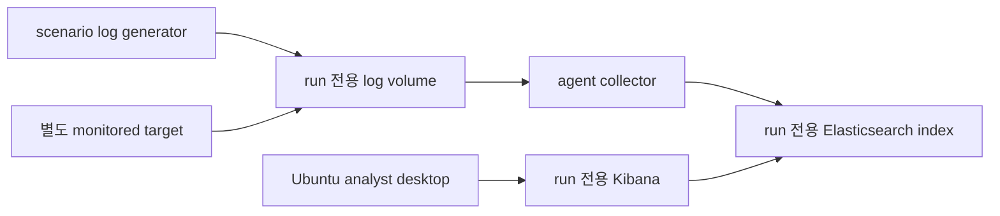

# 로컬 Docker 데스크톱 런타임

`Desktop` 모드는 웹과 API를 Windows에서 실행하고 Docker Desktop으로 run마다 폐기 가능한 실습 topology를 만듭니다. 브라우저는 컨테이너 포트에 직접 접속하지 않습니다. API에서 받은 일회용 티켓을 desktop gateway에서 교환한 뒤, gateway가 run 내부 Docker 네트워크의 데스크톱 HTTP/WebSocket만 프록시합니다.

## 시작

```powershell
.\scripts\stop-local.ps1
.\scripts\local-dev.ps1 -Mode Desktop -WebPort 3000 -ApiPort 18080 -SkipInstall
```

`http://localhost:3000`을 열어 Lab을 선택하고 접속 방식을 **브라우저 데스크톱**으로 배포합니다. 상태가 `ready`가 되면 **워크스페이스 열기**를 선택합니다. 최초 실행은 Ubuntu/Kali와 팀별 런타임 이미지를 내려받아 시간이 더 걸릴 수 있으며 이후 실행은 로컬 이미지 캐시를 재사용합니다. 로그와 프로세스 메타데이터는 `scripts/.runtime/`에 저장됩니다.

### 화면에서 Blue ELK 여는 순서

1. ZeroTOP 왼쪽 메뉴에서 **실습 워크스페이스**를 선택합니다.
2. Blue Team Lab을 선택하고 접속 방식을 **브라우저 데스크톱**으로 배포합니다.
3. 실행 상태가 `ready`가 되면 **워크스페이스 열기**를 누릅니다.
4. 열린 Ubuntu SOC 데스크톱에서 브라우저를 실행하고 주소 표시줄에 `http://kibana:5601`을 입력합니다.
5. Kibana의 **Analytics → Discover**에서 Lab에 만들어진 data view를 선택해 로그를 검색합니다.

`http://kibana:5601`은 해당 run의 격리된 Docker 네트워크에서만 해석되는 내부 주소입니다. Windows의 Chrome/Edge 주소 표시줄이나 ZeroTOP이 아닌 일반 브라우저 탭에 직접 입력하면 열리지 않는 것이 정상입니다. 또한 `http://localhost:5601`은 Docker 통합 모드의 공용 개발 Kibana 주소이며, `Desktop` 모드의 run 전용 Kibana 주소가 아닙니다.

### 일회용 티켓과 계속 유지되는 데스크톱 세션

**워크스페이스 열기**가 발급하는 URL의 `ticket`은 데스크톱에 처음 들어갈 때만 사용하는 일회용 입장권입니다. 기본 유효시간은 5분이며 Platform API의 `DESKTOP_TICKET_TTL_SECONDS`로 60~900초 범위에서 조정할 수 있습니다. 게이트웨이는 첫 요청에서 티켓을 교환한 뒤 URL에서 티켓을 제거하고 run에 결합된 서명 `HttpOnly` 쿠키를 설정합니다.

따라서 티켓이 만료되어도 이미 열린 Ubuntu 데스크톱이나 Kibana가 5분 뒤 종료되지는 않습니다. 같은 브라우저의 해당 세션은 **run 만료 시각**과 `DESKTOP_SESSION_MAX_MINUTES` 중 더 이른 시각까지 유지되며, run이 활성 상태인 동안 새로고침하거나 Kibana를 계속 사용할 수 있습니다. run을 종료하거나 TTL이 만료되면 쿠키가 남아 있어도 게이트웨이가 접근을 거부합니다. 일회용 티켓을 아직 교환하지 않은 채 5분이 지났다면 ZeroTOP에서 **워크스페이스 열기**를 다시 눌러 새 티켓을 받습니다.

## 팀별 로컬 topology

| 팀 | 생성되는 자원 | 학습자 경험 |
|---|---|---|
| Blue | Ubuntu analyst desktop, 별도 monitored target, run 전용 Elasticsearch/Kibana, agent, scenario log generator | 데스크톱 브라우저에서 Kibana를 열어 실행 전용 이벤트 검색 |
| Red | Kali desktop, 별도 제한 target | Kali에서 `target:8080` 등 topology가 선언한 endpoint에 접속 |

각 run은 별도 `--internal` Docker network를 사용합니다. desktop gateway만 해당 네트워크에 연결되며, run 종료·TTL 만료 시 컨테이너, 네트워크와 scenario volume을 함께 정리합니다. 준비 상태는 UI용 가짜 timer가 아니라 필수 컨테이너의 실제 health 결과를 사용합니다.

### Blue Team 로그 흐름



로컬 모드는 안전하고 반복 가능한 개발을 위해 AI topology의 ECS 형태 scenario event를 제한된 generator가 run volume에 만듭니다. agent 역할의 수집기가 이 파일을 읽어 해당 run의 Elasticsearch index로 전송합니다. analyst desktop은 Kibana에 접근하지만 다른 run의 network나 index에는 접근할 수 없습니다.

이 로컬 generator는 실제 악성코드나 임의 AI shell을 개발자 PC에서 실행하지 않습니다. 운영 KubeVirt 환경에서는 승인된 atomic action catalog를 별도 victim에서 재생하고, 그 결과를 victim의 Elastic Agent가 수집하는 방식으로 교체합니다. 두 모드 모두 정답 이벤트를 브라우저에 노출하지 않고, agent→수집→검색 경로의 준비 여부를 확인한다는 계약은 동일합니다.

### Red Team 연결 흐름

Red run은 Kali desktop과 취약 대상 역할의 target을 서로 다른 컨테이너로 만듭니다. 로컬 기본 target은 연결과 UI 흐름을 확인하기 위한 승인된 개발 이미지이며 CVE별 실제 취약 workload가 아닙니다. 운영에서는 AI가 만든 선언형 topology와 자동 검증을 통과한 digest 고정 target 이미지로 교체합니다.

## 접속 방식 제한

로컬 `Desktop` 모드는 `browser_desktop`만 실제로 제공합니다. OpenVPN은 TUN device, 실행별 PKI와 Kubernetes/KubeVirt runtime plane이 필요하므로 로컬 Docker 모드에서는 활성화하지 않습니다. API와 UI는 한 run에 브라우저 데스크톱 또는 OpenVPN 하나만 선택하는 계약을 유지하며 `both`를 허용하지 않습니다.

## Windows PowerShell 문제 해결

다음 명령은 저장소 루트에서 실행합니다. 먼저 API, runtime, desktop gateway가 모두 `ok`인지 확인합니다.

```powershell
Invoke-RestMethod http://localhost:18080/health
Invoke-RestMethod http://localhost:9000/health
Invoke-RestMethod http://localhost:9001/health
```

실습 화면에 표시된 Run ID를 넣고 runtime의 실제 준비 상태와 run 컨테이너를 확인합니다.

```powershell
$runId = "run_여기에_ID_입력"
$runtimeHeaders = @{ Authorization = "Bearer local-runtime-token" }

Invoke-RestMethod -Headers $runtimeHeaders "http://localhost:9000/v1/runs/$runId" |
  ConvertTo-Json -Depth 8

docker ps --filter "label=codegate.ai.run-id=$runId" --format '{{.Names}}  {{.Status}}'
```

Blue run이라면 `desktop`, `target`, `elasticsearch`, `kibana`, `elastic-agent`, `scenario-log-generator` 역할의 컨테이너가 실행 중이어야 합니다. 다음 명령으로 Ubuntu 데스크톱 내부의 `kibana` DNS와 Kibana 상태 API를 직접 확인합니다.

```powershell
$desktop = docker ps --filter "label=codegate.ai.run-id=$runId" --filter "label=codegate.ai.role=desktop" --format '{{.Names}}'
$kibana = docker ps --filter "label=codegate.ai.run-id=$runId" --filter "label=codegate.ai.role=kibana" --format '{{.Names}}'

docker exec $desktop getent hosts kibana
docker exec $desktop curl -fsS http://kibana:5601/api/status
docker logs --tail 100 $kibana
```

`getent hosts kibana`가 주소를 반환하지 않으면 해당 run의 Kibana 컨테이너 또는 run 전용 네트워크 구성을 확인해야 합니다. DNS는 정상인데 상태 API가 실패하면 `docker logs`의 Kibana 시작 오류를 확인합니다. `DNS_PROBE_FINISHED_NO_INTERNET`은 외부 인터넷 차단 자체를 뜻할 수도 있으므로, 먼저 입력한 주소가 정확히 `http://kibana:5601`인지와 위 내부 DNS 결과를 구분해 확인합니다.

## 운영 환경과의 차이

| 항목 | 로컬 Desktop | 운영 runtime plane |
|---|---|---|
| 워크스테이션/대상 | Docker 컨테이너 | KubeVirt VM과 제한된 Pod/VM |
| Blue ELK | 개발용 run 전용 stack/index | 인증·TLS·보존 정책이 적용된 run 전용 index/Kibana space |
| 로그 생성 | 제한된 ECS fixture generator | 승인된 행위 catalog를 victim에서 재생 후 Elastic Agent 수집 |
| Red target | 연결 확인용 승인 이미지 | AI 빌드·서명·SBOM·취약점 검증을 통과한 target |
| 접속 | loopback desktop gateway | desktop gateway 또는 실행별 OpenVPN 중 하나 |
| 격리 | Docker internal network | namespace, NetworkPolicy, KubeVirt와 admission policy |

## 보안 경계

이 모드는 신뢰할 수 있는 개발 워크스테이션에서만 사용합니다. desktop과 target 포트를 host에 직접 공개하지 않고, privileged 컨테이너와 host mount를 사용하지 않으며, run마다 internal network를 분리합니다. 다만 컨테이너는 Docker Desktop Linux kernel을 공유하므로 kernel exploit, 실제 malware 또는 신뢰할 수 없는 공격 payload는 개발자 PC에서 실행하지 않습니다. 그러한 행위는 전용 KubeVirt/KVM 인프라에서 승인된 시나리오 action과 자동 격리 검증을 거쳐야 합니다.

Hack The Box 등에서 공개적으로 확인 가능한 브라우저 워크스페이스와 별도 target UX는 참고할 수 있지만, 이 문서는 해당 서비스의 비공개 내부 구조를 설명하지 않습니다. ZeroTOP의 로컬 topology는 이 저장소의 계약과 구현만을 기준으로 합니다.
